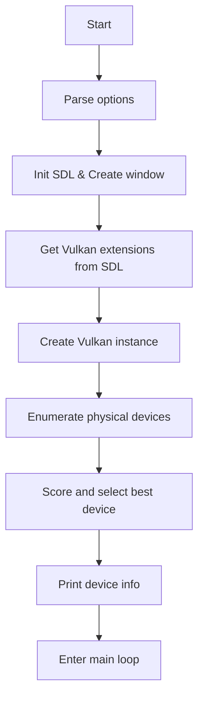

# Tutorial 01: Vulkan Instance and Device Selection

## Goal

The goal of this tutorial is to initialize a Vulkan instance and select a suitable physical device (GPU) for rendering. This is the foundational step for any Vulkan application, as it establishes the connection between your program and the Vulkan driver, and picks the hardware that will execute your graphics commands.

## Flowchart

## Main Steps & Ideas

1. **Initialize SDL and Create a Window**
   - Use SDL3 to create a window with Vulkan support.
   - Query SDL for the required Vulkan instance extensions.

2. **Create a Vulkan Instance**
   - Specify application info and required extensions.
   - Optionally enable validation layers for debugging.
   - Set up debug messaging if validation layers are available.

3. **Enumerate Physical Devices**
   - Query all available GPUs (physical devices) from the Vulkan instance.
   - Gather properties and features for each device.

4. **Rate and Select the Best Device**
   - Score devices based on type (discrete, integrated, etc.), supported features, and queue families.
   - Prefer devices with graphics, transfer, and compute queues.
   - Select the device with the highest score that meets requirements.

5. **Setup for Rendering**
   - Ensure the selected device has a graphics queue family.
   - Prepare for further steps (not covered in this tutorial) like swapchain creation and rendering.
