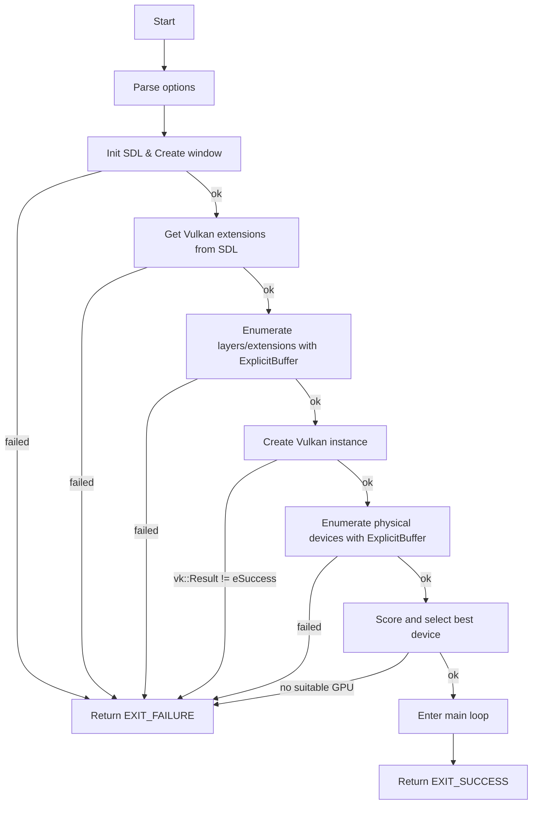

# Tutorial 01 (nothrow): Vulkan Instance and Device Selection

## Goal

This variant keeps the Tutorial 01 behavior (create an instance and pick a GPU) while avoiding exception-based control flow and avoiding Vulkan-Hpp enhanced-mode allocations during enumeration.

It uses `vulkan.hpp` with:

- `VULKAN_HPP_NO_EXCEPTIONS`
- `VULKAN_HPP_DISABLE_ENHANCED_MODE`
- `VULKAN_HPP_ASSERT_ON_RESULT(expr)` defined as a no-op

## Why this variant is different

The regular tutorial uses `vk::raii` wrappers and APIs that may rely on dynamic standard-library containers such as `std::vector` in enumeration paths.

For this **nothrow** version, the code:

- does **not** use `vulkan_raii.hpp`
- uses non-RAII Vulkan-Hpp handle APIs (`vk::Instance`, `vk::PhysicalDevice`, etc.)
- checks `vk::Result` explicitly
- uses explicit storage via `ExplicitBuffer<T>` for enumeration data

## Key Differences from Tutorial 01

| Aspect | Tutorial 01 | Tutorial 01 (nothrow) |
|---|---|---|
| Error handling | Exceptions (`vk::SystemError` / app exceptions) | Explicit return-value checks (`vk::Result`, `bool`) |
| Vulkan-Hpp mode | Default (enhanced mode) | `VULKAN_HPP_NO_EXCEPTIONS` + `VULKAN_HPP_DISABLE_ENHANCED_MODE` |
| Vulkan object style | `vk::raii::*` wrappers | Non-RAII handles + explicit cleanup |
| Enumeration storage | Library-managed dynamic containers | `ExplicitBuffer<T>` with `new (std::nothrow)` |
| `main()` | `try`/`catch` | Direct call, return code only |

## Explicit enumeration storage

`ExplicitBuffer<T>` is a small vector-like container used by this tutorial to keep memory management explicit and allocation-failure aware.

It is now shared from the common tutorial library header:

- `tutorial/00_common/include/egomez/vulkan_tutorial/explicit_buffer.h`

Design goals:

- C++11 compatible
- no dynamic standard-library containers
- allocation via `new (std::nothrow)`
- API similar to `std::vector` (`resize`, `push_back`, `data`, `size`, iterators)

Enumeration follows a two-step pattern via `enumerateWithStorage`:

1. call Vulkan function with `data == nullptr` to get item count
2. resize explicit storage
3. call Vulkan function again to fill storage

If allocation fails, the function returns `false` and the app exits cleanly without throwing.

## Flowchart

## Notes on API boundaries

The tutorial keeps `vk::` namespaced types/enums where practical, but uses C ABI types where required by extension function pointers:

- debug callback signature uses `Vk*` callback parameter types
- debug messenger create/destroy uses loader function pointers (`PFN_vkCreateDebugUtilsMessengerEXT`, `PFN_vkDestroyDebugUtilsMessengerEXT`)

This keeps compatibility with the Vulkan loader ABI while preserving the Vulkan-Hpp style in the rest of the code.
